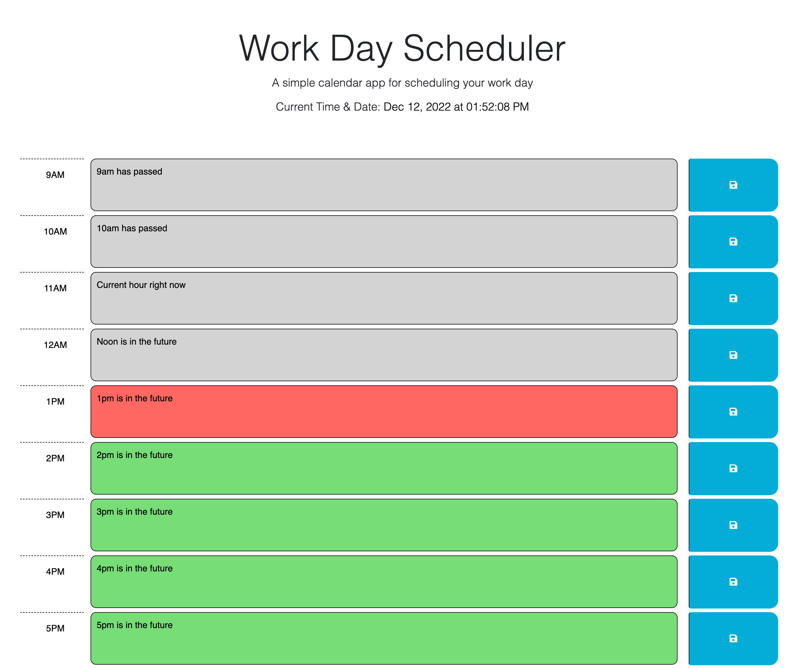

# Day-Planner

## Description

- This application is a way to help schedule your day.

- Depending on the current time which is displayed at the top, the time blocks background color will change.

- Red is the current hour. Grey is in the past. Green is in the future.

- Upon clicking save, whatever the user enters will be logged to local storage and will be there upon refresh.

## Installatiom

- N/A

## Usage

- Link to webpage https://averynewhart.github.io/Day-Planner/
